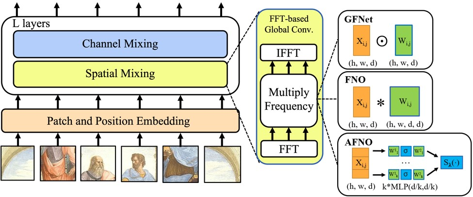

# Adaptive Fourier Neural Operators: Efficient Token Mixers for Transformers

This repository contains PyTorch implementation of the Adaptive Fourier Neural Operator token mixer. Classification code is also provided in the `classification` folder.

The Adaptive Fourier Neural Operator is a token mixer that learns to mix in the Fourier domain. AFNO is based on a principled foundation of operator learning which allows us to frame token mixing as a continuous global convolution without any dependence on the input resolution. This principle was previously used to design FNO, which solves global convolution efficiently in the Fourier domain and has shown promise in learning challenging PDEs. To handle challenges in visual representation learning such as discontinuities in images and high resolution inputs, we propose principled architectural modifications to FNO which results in memory and computational efficiency. This includes imposing a block-diagonal structure on the channel mixing weights, adaptively sharing weights across tokens, and sparsifying the frequency modes via soft-thresholding and shrinkage. The resulting model is highly parallel with a quasi-linear complexity and has linear memory in the sequence size.



[[arXiv]](https://arxiv.org/pdf/2111.13587.pdf)

## Usage

### Requirements

- torch>=1.8.0
- torchvision
- timm

*Note*: To use the ```rfft2``` and ```irfft2``` functions in PyTorch, you need to install PyTorch>=1.8.0. Complex numbers are supported after PyTorch 1.6.0, but the ```fft``` API is slightly different from the current version. 


### Installation
```
pip install -e .
```

### Example

```
from afno import AFNO1D, AFNO2D

mixer = AFNO1D()
mixer = AFNO2D()
```

## License
MIT License

## Citation
If you find our work useful in your research, please consider citing:
```
@article{guibas2021adaptive,
  title={Adaptive Fourier Neural Operators: Efficient Token Mixers for Transformers},
  author={Guibas, John and Mardani, Morteza and Li, Zongyi and Tao, Andrew and Anandkumar, Anima and Catanzaro, Bryan},
  journal={arXiv preprint arXiv:2111.13587},
  year={2021}
}
```
